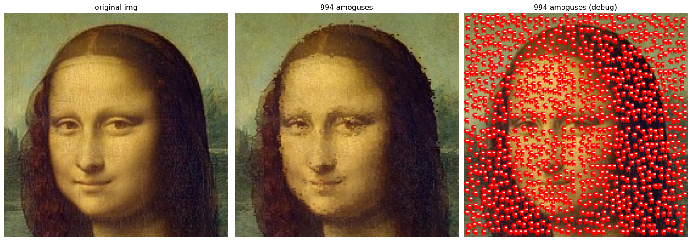

# Amogus dithering

(Not actually real dithering, it just kinda dithers per local amogus crop, but not globally)

Will hide as many amoguses/amogusi in your image while not affecting the edges or colors (can be managed how much).

Feel free to copy and modify (read img from link, more parameters, value modifications, another pattern, actual global dithering...) as you wish.

Files: 
- amogus_sandbox : my dev and sandbox file
- amogus_funcs : small simple version of the functions and their call
- amogus_extra_lpips_flip : version that inclues a LPIPS value (perceptual difference metric) and FLIP loss (image showing differences)

Here is [an interactive Colab Notebook](https://colab.research.google.com/drive/1_EHTK36c-pq456ue2xcLUTbBPOr1pppN?usp=sharing), to test quickly on your own images.

