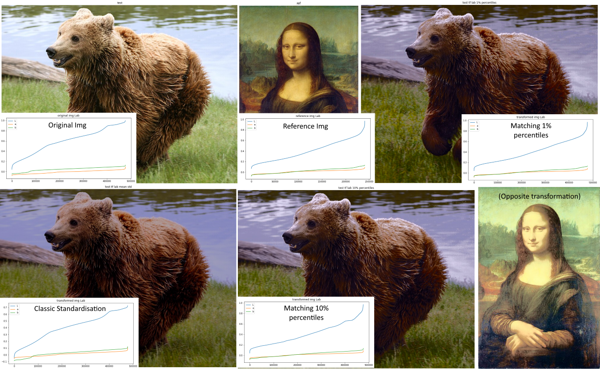

# Color Distribution Swap

How much difference is there between matching two distributions just on their mean and standard deviation, and matching them by forcing every x% percentile (25%, 10%, 5%, 2%...) to match?

This code answers this visually by taking two images, converting their color to a more convenient color space (a Lab space, here OkLab accessed through the colour library but you could use any CIELab implementation for similar results), and then lining up every x% percentile of the two 3D distributions with a simple linear transformation.

Results: 
- in nearly all the 10-100 different examples tried, matching percentiles gives a more accurate result than just matching mean and standard deviation
- going from matching every 10% percentile to every 5% and 2% still impacts the results visually, even though the distribution is barely affected, in some cases even going from 2% to 1% is noticeable (extreme whites and blacks)
- swapping images with very different color palettes and/or artstyles can either work very well or very badly
- does nothing on pure black and white, but can boost low-contrast pictures to look like any other
- lots of artifacts, probably due to re-casting the transformed Lab distribution back to RGB (I think the handling of points that land outside the RGB space is just "truncate to fit" and not "get closest Lab point that works, then retransforms")
